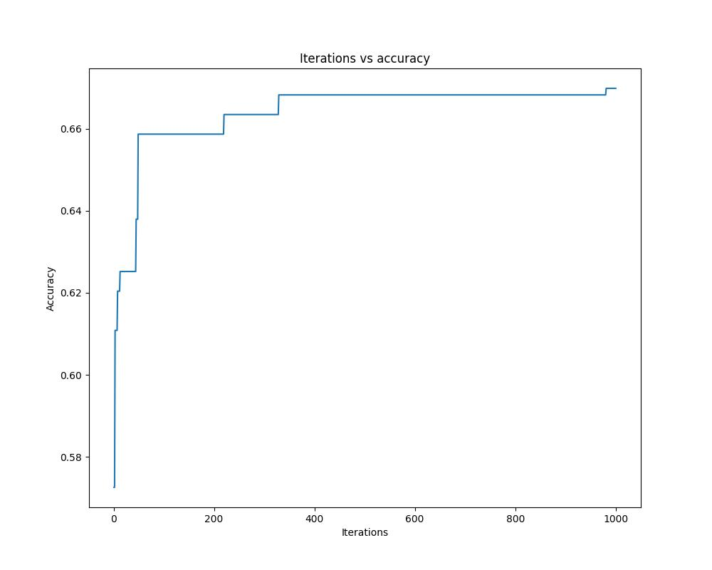

<h1>SVM OPTIMIZATION</h1>
<h2>Mohit</h2>
<h2>102197021</h2>
<h4>Different Samples</h4>
<table class="table table-bordered table-hover table-condensed">
    <thead><tr><th title="Field #1">Sample</th>
    <th title="Field #2">Accuracy</th>
    <th title="Field #3">Kernel</th>
    <th title="Field #4">C</th>
    <th title="Field #5">Gamma</th>
    </tr></thead>
    <tbody><tr>
    <td>s1</td>
    <td>0.6539074960127592</td>
    <td>rbf</td>
    <td align="right">1.0</td>
    <td align="right">0.33</td>
    </tr>
    <tr>
    <td>s2</td>
    <td>0.6570972886762361</td>
    <td>rbf</td>
    <td align="right">0.96</td>
    <td align="right">0.41</td>
    </tr>
    <tr>
    <td>s3</td>
    <td>0.6427432216905901</td>
    <td>rbf</td>
    <td align="right">0.99</td>
    <td align="right">0.38</td>
    </tr>
    <tr>
    <td>s4</td>
    <td>0.6810207336523126</td>
    <td>rbf</td>
    <td align="right">0.95</td>
    <td align="right">0.49</td>
    </tr>
    <tr>
    <td>s5</td>
    <td>0.6411483253588517</td>
    <td>rbf</td>
    <td align="right">1.0</td>
    <td align="right">0.44</td>
    </tr>
    <tr>
    <td>s6</td>
    <td>0.6523125996810207</td>
    <td>poly</td>
    <td align="right">0.87</td>
    <td align="right">0.94</td>
    </tr>
    <tr>
    <td>s7</td>
    <td>0.6730462519936204</td>
    <td>rbf</td>
    <td align="right">0.98</td>
    <td align="right">0.37</td>
    </tr>
    <tr>
    <td>s8</td>
    <td>0.6182108626198083</td>
    <td>rbf</td>
    <td align="right">0.97</td>
    <td align="right">0.51</td>
    </tr>
    <tr>
    <td>s9</td>
    <td>0.6261980830670927</td>
    <td>rbf</td>
    <td align="right">0.97</td>
    <td align="right">0.23</td>
    </tr>
    <tr>
    <td>s10</td>
    <td>0.5990415335463258</td>
    <td>rbf</td>
    <td align="right">1.0</td>
    <td align="right">0.32</td>
    </tr>
    </tbody></table>
    <h3>Sample 3 has highest accuracy</h3>
    <h4>So for this sample we can conculate how does accuracy work with number of iterations</h4>
    
    <h3>as we can see initally accuracy increases greatly but after that it increases almost negligibly</h3>
    <h4>dataset <a href="https://archive.ics.uci.edu/ml/datasets/Avila">https://archive.ics.uci.edu/ml/datasets/Avila</a></h4>
